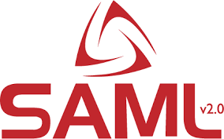

[](https://classroom.github.com/a/SzF9yXvI)
<h1 id="shraga">Shraga :nerd_face:</h1>




In this workshop we will be covering **Shraga** which is an auth proxy we use for user authentication.

The goal of this readme is to serve as a refresher for you when you need to work with **Shraga** or just forgot some of the details.

<h2 id="table-of-contents">:scroll: Table of Contents</h2>

- [Shraga :nerd_face:](#shraga)
  - [:scroll: Table of Contents](#table-of-contents)
  - [:books: Workshop Contents](#contents)
  - [:page_with_curl: The gist of things](#the-gist-of-things)
  - [:memo: Cheat Sheet](#cheat-sheet)
    - [:wrench: Shraga user Interface](#shraga-user-interface)
    - [:wrench: Parse and Check Shraga JWT](#shraga-jwt)
    - [:wrench: Auth routes](#auth-routes)

<h2 id="contents">:books: Workshop Contents</h2>

- Active Directory
- ADFS (Active Directory Federation Service)
- SAML
- Oauth
- JWT
- How shraga works
- How to use shraga

<h2 id="the-gist-of-things">:page_with_curl: The gist of things</h2>

User authentication with shraga goes like this:

```text
╭────────────╮  
│    ADFS    │ ⑤ ADFS redirects the user to shraga with a SAML response
╰────────────╯
   ④⇧  ⑤⇩
╭────────────╮
│            │ ③ User is redirected to shraga
│   Shraga   │ ④ Shraga redirects the user to ADFS
│            │ ⑥ Shraga redirects the user to the callback url with a new jwt access token
╰────────────╯
   ③⇧  ⑥⇩
╭────────────╮
│            │ ① User sends a request to the Backend (Client -> Backend)
│    User    │ ② Backend responds with 401 (Unauthorized) (Backend -> Client)
│            │ ⑦ User sends authenticated request to the Backend (Client -> Backend)
╰────────────╯
  ①⇩ ②⇧ ⑦⇳
╭────────────╮
│  Back-end  │ ⑦ Backend validates the access token and responds with the requested data
╰────────────╯
```

➤ User enters the site

➤ The client makes a request to the backend

➤ The backend checks the **cookies** for an `access token` and responds with **401 (Unauthorized)** since there is none

➤ The client **redirects** the user to shraga with the **callback url** - either straight from the UI or through the backend (`/auth/login` request)

➤ Shraga redirects the user to ADFS (Active Directory Federation Services) for authentication

➤ The user enters his credentials

➤ ADFS redirects the user to shraga with a **SAML response**

➤ Shraga parses the response and redirects the user to the callback url with a new jwt `access token` (The callback has to be a backend route since it is a `POST` request)

➤ The backend receives the `access token`, validates it and redirects the user to the site with the original `relay-state` (The relay state is the original url the user tried to access)

➤ The client receives the `access token` and stores it in the **cookies**

➤ Now the client can make requests to the backend with the `access token` in the **cookies** and the backend will validate it and respond with the requested data

<h2 id="cheat-sheet">:memo: Cheat Sheet</h2>

<h3 id="shraga-user-interface">:wrench: Shraga user Interface</h3>

```typescript
interface ShragaUser {
    id: string;
    adfsId: string;
    genesisId: string;
    name: { firstName: string; lastName: string };
    displayName: string;
    provider: 'Genesis' | string;
    entityType: string;
    unit: string;
    dischargeDay: string;
    rank: string;
    job: string;
    phoneNumbers: string[];
    address: string;
    photo: any;
    RelayState: string;
    exp: number;
    iat: number;
    jti: string;
}
```

<h3 id="shraga-jwt">:wrench: Parse and Check Shraga JWT</h3>

You should add your custom validations to the `parseJWT` function.
Sometimes when the user exists in the Active Directory but not in Kartoffel the token will be valid but we still want to reject it.

```typescript
const parseJWT = (token: string) => {
    const payload = jwt.verify(token, Buffer.from(shragaConfig.secret, "base64"), {
        clockTimestamp: Date.now() / 1000,
    });
    if (typeof payload !== "object") throw new Error("Invalid token");
    // Check the token here to make sure it satisfies your needs
    return payload as Express.User;
};
```

<h3 id="auth-routes">:wrench: Auth routes</h3>

```typescript
app.get("/auth/login", (req, res) => {
    let redirectUrl =
        shragaConfig.shragaUrl +
        `/setCallback/${encodeURIComponent(shragaConfig.callbackURL)}` +
        `?SignInSecret=${encodeURIComponent(shragaConfig.secret)}` +
        `&useEnrichId=${shragaConfig.useEnrichId}` +
        `&RelayState=${req.query.relayState || "/"}`;

    res.redirect(redirectUrl);
});

app.post("/auth/callback", (req, res) => {
    const token = String(req.query.jwt);

    try {
        const payload = parseJWT(token);
        res.cookie("access-token", token);
        res.redirect(payload.RelayState || "/");
    } catch (error) {
        res.status(403).send("Unauthorized");
    }
});
```
